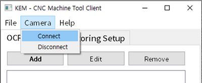
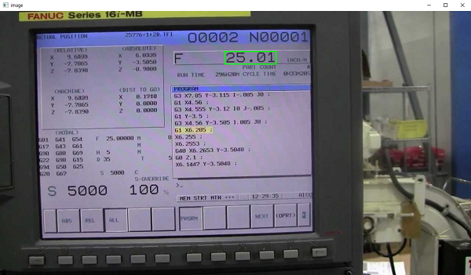
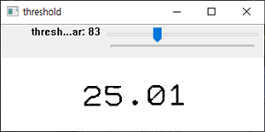
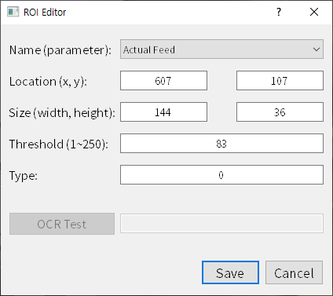
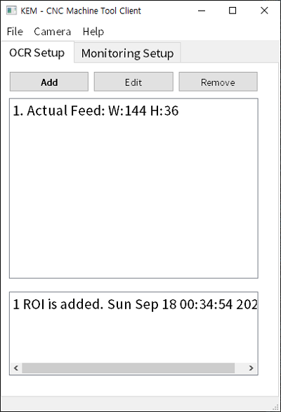
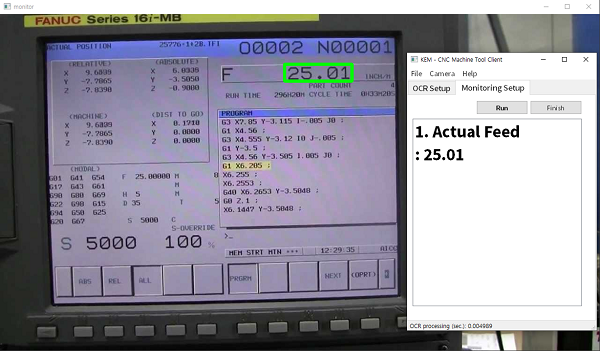

# How to use - Proto_2018-x-coprs
0. 필요한 라이브러리 설치  
1. **custom_tessdata** 폴더의 **cnc-2018.traineddata** 파일을 Tesseract-OCR의 **tessdata** 폴더로 복사  
2. **kem_cncmt_client_demo_app.py** 실행, Client App이 나타남  
4. **Camera** 메뉴의 **Connect**를 실행, CNC HMI 샘플 이미지 화면이 나타남  

5. 키보드의 ‘**c**’ 키를 누른 다음, 모니터링 하고자 하는 영역을 드래그하여 선택, **threshold 설정 다이얼로그**가 나타남  

6. 회색조 이미지로 데이터가 잘 보이도록, Threshold 설정 슬라이드를 조정, 키보드에서 ‘**t**’ 키를 누르면 **ROI Editor 다이얼로그**가 나타남  

7. **Name** 리스트에서 알맞은 항목을 선택하고, **Save** 버튼을 클릭하여 저장  

8. 저장된 ROI 정보를 Client App에서 확인  
9. **Monitoring Setup** 탭에서 **Run** 버튼을 누르면, 저장된 ROI에 대한 OCR 처리 결과가 모니터링됨  

